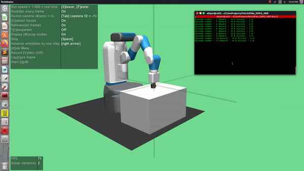

# Reinforcement Learning for Robot Control
> Train the Fetch Robot to slide the puck to the goal position

The aim of this project is to use reinforcement learning to make the Fetch Robot slide a puck to the goal position on the table. For the same, we implement Vanilla Deep Deterministic Policy Gradient (DDPG) [link to paper](https://arxiv.org/abs/1509.02971) and DDPG with Hindsight Experience Replay (HER) [Link to paper](https://arxiv.org/abs/1707.01495) to make use of failed experiences.




## Requirements

The codebase is implemented in Python 3.7. To install the necessary requirements, run the following commands:

If you use the python shipped virtual environments:
```
python3 -m venv <your_env_name>
source your_env_name/bin/activate
pip3 install -r requirements.txt
```

If you use conda:
```
conda create <your_env_name>
conda activate your_env_name 
conda install --yes --file requirements.txt
while read requirement; do conda install --yes $requirement; done < requirements.txt
```

## Environments
To perform the RL experiments, the wonderful OpenAI Gym

## Datasets

The scripts for downloading and loading the MNIST and CIFAR10 datasets are included in the `datasets_loader` folder. These scripts will be called automatically the first time the `main.py` script is run.

## Options

Training and inference of RL models to perform tasks on the various Fetch environments is handled by the `main.py` script which provides the following command-line arguments

```
  --env_name             Fetch environment name
  --epochs               number of epochs
  --timesteps            number of iterations of network update
  --start_steps          initial number of steps for random exploration
  --max_ep_len           maximum length of episode
  --buff_size            size of replay buffer
  --phase                train or test
  --model_dir            path to model directory
  --test_episodes        number of episodes testing should run
  --clip-obs             the clip ratio
  --clip-range           the clip range
  --lr_actor             learning rate for actor
  --lr_critic            learning rate for critic
  --noise_scale          scaling factor for gaussian noise on action
  --gamma                discount factor in bellman equation
  --polyak               polyak value for averaging
  --cuda                 whether to use GPU
  --her                  whether to use HER
```

## Examples

_Training model on CPU on the Fetch Environment <EnvName>_

```
python main.py --phase=train --env_name=EnvName --cuda=False 
```

_Testing using pretrained model_

```
python main.py --phase=test
```

## Meta

Akshay Iyer – [@akshay_iyerr](https://twitter.com/akshay_iyerr) – akshay.iyerr@gmail.com

[Github](https://github.com/akshay-iyer/)

## Contributing

1. Fork it (<https://github.com/yourname/yourproject/fork>)
2. Create your feature branch (`git checkout -b feature/fooBar`)
3. Commit your changes (`git commit -am 'Add some fooBar'`)
4. Push to the branch (`git push origin feature/fooBar`)
5. Create a new Pull Request

<!-- Markdown link & img dfn's -->
[npm-image]: https://img.shields.io/npm/v/datadog-metrics.svg?style=flat-square
[npm-url]: https://npmjs.org/package/datadog-metrics
[npm-downloads]: https://img.shields.io/npm/dm/datadog-metrics.svg?style=flat-square
[travis-image]: https://img.shields.io/travis/dbader/node-datadog-metrics/master.svg?style=flat-square
[travis-url]: https://travis-ci.org/dbader/node-datadog-metrics
[wiki]: https://github.com/yourname/yourproject/wiki

